# MyWeekendsLeft Infrastructure

This directory contains the infrastructure-as-code and deployment configuration for the MyWeekendsLeft API.

## 🏗️ Infrastructure Components

### GitHub Actions CI/CD
- **Location**: `.github/workflows/`
- **Pipelines**:
  - `build-and-deploy.yml` - Main deployment pipeline
  - `pr-validation.yml` - Pull request validation

### Terraform
- **Location**: `infrastructure/tf/prod/`
- **Provider**: Azure (AzureRM v3.x)
- **Resources**:
  - App Service Plan (S1, Windows)
  - App Service (Production)
  - Application Insights
  - Resource Group

---

## 🚀 Deployment Setup

### Prerequisites

1. **Azure Resources** (via Terraform)
2. **GitHub Secrets** configured
3. **.NET 9 SDK** (for local development)

### 1. Deploy Infrastructure with Terraform

```bash
cd infrastructure/tf/prod

# Initialize Terraform
terraform init

# Review the planned changes
terraform plan -var="environment=prod"

# Apply the configuration
terraform apply -var="environment=prod"
```

**Important Outputs:**
- `app_service_name` - Your Azure App Service name
- `app_service_default_hostname` - Production URL

### 2. Configure GitHub Secrets

You need to add one secret to your GitHub repository:

#### Get Publish Profile from Azure

**For Production:**
```bash
az webapp deployment list-publishing-profiles \
  --name app-mwl-prod-001 \
  --resource-group rg-mwl-prod-001 \
  --xml > production-profile.xml
```

#### Add Secret to GitHub

1. Go to your repository on GitHub
2. Navigate to **Settings** → **Secrets and variables** → **Actions**
3. Click **New repository secret**
4. Add the following secrets:

| Secret Name | Value | Source |
|------------|-------|--------|
| `AZURE_WEBAPP_PUBLISH_PROFILE` | Contents of `production-profile.xml` | Production profile |
| `AZURE_WEBAPP_PUBLISH_PROFILE_STAGING` | Contents of `staging-profile.xml` | Staging profile |

**Delete the XML files after adding secrets:**
```bash
rm production-profile.xml staging-profile.xml
```

### 3. Configure GitHub Environments (Optional but Recommended)

For production approvals and protection:

1. Go to **Settings** → **Environments**
2. Create a **Production** environment
3. Configure the Production environment:
   - Add required reviewers (yourself or team members)
   - Set deployment branch policy to `main` only
   - Add environment secrets if needed

---

## 📊 CI/CD Pipeline

### Workflow Triggers

**Main Deployment Pipeline** (`build-and-deploy.yml`):
- ✅ Push to `main` branch → Full deployment
- ✅ Pull requests → Build and test only
- ✅ Manual trigger via workflow_dispatch

**PR Validation** (`pr-validation.yml`):
- ✅ Pull request opened/updated → Run all tests

### Pipeline Stages

```mermaid
graph LR
    A[Build & Test] --> B{Tests Pass?}
    B -->|Yes| C[Deploy to Production]
    B -->|No| D[❌ Fail]
    C --> E[Verify Production]
    E --> F[✅ Complete]
```



### Test Execution

The pipeline runs **39 tests** in three categories:

1. **Unit Tests** (11 tests) - Service layer logic
2. **Integration Tests** (3 tests) - Service integration with external APIs
3. **API Integration Tests** (25 tests) - Full HTTP pipeline testing

### Deployment Flow

1. **Build**
   - Restore dependencies
   - Build solution in Release mode
   - Run all tests with code coverage

2. **Deploy to Production**
   - Publish application
   - Deploy to production App Service
   - Verify `/health` endpoint

---

## 🔧 Terraform Configuration

### Resource Naming Convention

All resources follow Azure naming best practices:

| Resource Type | Pattern | Example |
|--------------|---------|---------|
| Resource Group | `rg-{app}-{env}-{instance}` | `rg-mwl-prod-001` |
| App Service Plan | `plan-{app}-{env}-{instance}` | `plan-mwl-prod-001` |
| App Service | `app-{app}-{env}-{instance}` | `app-mwl-prod-001` |
| App Insights | `appi-{app}-{env}-{instance}` | `appi-mwl-prod-001` |

### Key Features Configured

✅ **Health Checks**: `/health` endpoint monitored every 2 minutes
✅ **HTTPS Only**: All traffic forced to HTTPS
✅ **TLS 1.2 Minimum**: Secure communications enforced
✅ **.NET 9**: Latest framework configured
✅ **Application Insights**: Full telemetry and monitoring
✅ **CORS**: Configured to allow all origins (adjust as needed)
✅ **HTTP/2**: Enabled for better performance
✅ **Always On**: Prevents cold starts
✅ **Logging**: Application and HTTP logs enabled

### Variables

Defined in `variables.tf`:

| Variable | Description | Default |
|----------|-------------|---------|
| `environment` | Environment name | (required) |
| `location` | Azure region | `australiasoutheast` |

### Outputs

After `terraform apply`, you'll get:

- Resource group name
- App Service URL (production)
- Application Insights keys
- App ID

---

## 🔒 Security Considerations

### ⚠️ IMPORTANT: Old Credentials Removed

The old PowerShell script with hardcoded Azure Storage credentials has been **permanently removed**.

**Action Required:**
1. ✅ Credentials removed from this repository
2. ⚠️ **You should rotate the storage account key** in Azure Portal
3. ⚠️ **Review git history** if credentials need to be purged

### Current Security Measures

✅ Secrets stored in GitHub Secrets (encrypted)
✅ Publish profiles used for deployment (time-limited)
✅ HTTPS enforced on all endpoints
✅ TLS 1.2 minimum
✅ Application Insights keys marked as sensitive in Terraform

---

## 🧪 Local Testing

Before pushing to trigger deployment:

```bash
cd api/MWL

# Restore and build
dotnet restore
dotnet build --configuration Release

# Run tests
dotnet test --configuration Release --filter "Category=Unit"
dotnet test --configuration Release --filter "Category=Integration"
dotnet test --configuration Release --filter "Category=API-Integration"

# Run all tests
dotnet test --configuration Release
```

---

## 📈 Monitoring

### Application Insights

Access Application Insights in Azure Portal:
```
Resource Group: rg-mwl-prod-001
Resource: appi-mwl-prod-001
```

**Key Metrics to Monitor:**
- Request rate and response times
- Failed request rate
- Server exceptions
- Dependency calls (to population.io API)
- Availability (via health check)

### Health Check Endpoint

Both production and staging monitor the `/health` endpoint:
- **URL**: `https://app-mwl-prod-001.azurewebsites.net/health`
- **Staging**: `https://app-mwl-prod-001-staging.azurewebsites.net/health`
- **Expected Response**: `200 OK` with body `"Healthy"`
- **Check Interval**: Every 2 minutes
- **Eviction Time**: 2 minutes (app restarted if unhealthy)

---

## 🛠️ Troubleshooting

### Deployment Fails

**Check GitHub Actions logs:**
1. Go to **Actions** tab in GitHub
2. Click on the failed workflow run
3. Expand the failed step to see error details

**Common Issues:**
- ❌ Publish profile expired → Regenerate and update secrets
- ❌ Tests failing → Check test logs, fix code
- ❌ Health check fails → Check API startup logs in Azure

### App Service Issues

**View logs in Azure Portal:**
1. Navigate to your App Service
2. Go to **Monitoring** → **Log stream**
3. Or download logs from **Advanced Tools** (Kudu)

**Quick Commands:**
```bash
# Restart app service
az webapp restart --name app-mwl-prod-001 --resource-group rg-mwl-prod-001

# View recent logs
az webapp log tail --name app-mwl-prod-001 --resource-group rg-mwl-prod-001

# Check health
curl https://app-mwl-prod-001.azurewebsites.net/health
```

---

## 📝 Maintenance Tasks

### Update Terraform

```bash
cd infrastructure/tf/prod

# Update providers
terraform init -upgrade

# Review changes
terraform plan -var="environment=prod"

# Apply if safe
terraform apply -var="environment=prod"
```

### Rotate Publish Profiles

Publish profiles should be rotated periodically (recommended: every 90 days):

```bash
# Regenerate profiles
az webapp deployment list-publishing-profiles \
  --name app-mwl-prod-001 \
  --resource-group rg-mwl-prod-001 \
  --xml

# Update GitHub secrets with new profiles
```

### Scale App Service

To change the App Service plan tier:

1. Edit `infrastructure/tf/prod/main.tf`
2. Change `sku_name` in `azurerm_service_plan` resource
3. Run `terraform apply -var="environment=prod"`

**Available SKUs:**
- `B1` - Basic (dev/test)
- `S1` - Standard (current, recommended)
- `P1V2` - Premium (production scale)

---

## 🔄 Migration Notes

### From Azure DevOps to GitHub Actions

**Completed:**
- ✅ GitHub Actions workflows created
- ✅ Old Azure Pipelines YAML removed
- ✅ Deployment configured with secrets
- ✅ Multi-stage pipeline (staging → production)
- ✅ Test execution fixed (was broken in Azure DevOps)

**Manual Steps Required:**
1. Configure GitHub Secrets (see section above)
2. Verify first deployment succeeds
3. (Optional) Remove Azure DevOps project if no longer needed

### Terraform Modernization

**Completed:**
- ✅ Updated to AzureRM provider v3.x
- ✅ Replaced deprecated resources
- ✅ Added health check configuration
- ✅ Added resource tagging
- ✅ Fixed interpolation syntax
- ✅ Added .NET 9 configuration
- ✅ Removed hardcoded values

---

## 📞 Support

For issues or questions:
- Check this documentation
- Review GitHub Actions logs
- Check Azure Portal logs
- Review Application Insights telemetry

---

**Last Updated**: January 2026
**Terraform Version**: >= 1.0
**AzureRM Provider**: ~> 3.0
**.NET Version**: 9.0
