# MyWeekendsLeft Infrastructure

This directory contains the infrastructure-as-code and deployment configuration for the MyWeekendsLeft API.

## 🏗️ Infrastructure Components

### GitHub Actions CI/CD
- **Location**: `.github/workflows/`
- **Pipelines**:
  - `build-and-deploy.yml` - Main deployment pipeline (DEV & UAT)
  - `pr-validation.yml` - Pull request validation

### Terraform
- **Location**: `infrastructure/tf/`
- **Provider**: Azure (AzureRM v3.x)
- **Environments**:
  - `tf/dev/` - DEV environment configuration
  - `tf/uat/` - UAT environment configuration
- **Resources** (per environment):
  - App Service Plan (S1, Windows)
  - App Service
  - Application Insights

---

## 🌍 Environments

| Environment | Resource Group | App Service | URL |
|-------------|---------------|-------------|-----|
| **DEV** | `dev` | `dev-myweekendsleft-api` | https://dev-myweekendsleft-api.azurewebsites.net |
| **UAT** | `uat` | `uat-myweekendsleft-api` | https://uat-myweekendsleft-api.azurewebsites.net |

### Deployment Triggers

| Branch | Deploys To |
|--------|-----------|
| `develop` | DEV |
| `main` | UAT |

---

## 🚀 Deployment Setup

### Prerequisites

1. **Azure Resources** - Existing App Services in Azure
2. **GitHub Secrets** - Publish profiles configured
3. **.NET 10 SDK** - For local development

### 1. Configure GitHub Secrets

You need to add two secrets to your GitHub repository:

#### Get Publish Profiles from Azure

```bash
# DEV publish profile
az webapp deployment list-publishing-profiles \
  --name dev-myweekendsleft-api \
  --resource-group dev \
  --xml

# UAT publish profile
az webapp deployment list-publishing-profiles \
  --name uat-myweekendsleft-api \
  --resource-group uat \
  --xml
```

#### Add Secrets to GitHub

1. Go to your repository on GitHub
2. Navigate to **Settings** → **Secrets and variables** → **Actions**
3. Click **New repository secret**
4. Add the following secrets:

| Secret Name | Value | Environment |
|------------|-------|-------------|
| `AZURE_WEBAPP_PUBLISH_PROFILE_DEV` | DEV publish profile XML | DEV |
| `AZURE_WEBAPP_PUBLISH_PROFILE_UAT` | UAT publish profile XML | UAT |

### 2. Configure GitHub Environments (Optional but Recommended)

For environment approvals and protection:

1. Go to **Settings** → **Environments**
2. Create **DEV** and **UAT** environments
3. Configure each environment:
   - Add required reviewers (for UAT)
   - Set deployment branch policies
   - Add environment secrets if needed

---

## 📊 CI/CD Pipeline

### Workflow Triggers

**Main Deployment Pipeline** (`build-and-deploy.yml`):
- ✅ Push to `develop` branch → Deploy to DEV
- ✅ Push to `main` branch → Deploy to UAT
- ✅ Pull requests → Build and test only
- ✅ Manual trigger via workflow_dispatch

**PR Validation** (`pr-validation.yml`):
- ✅ Pull request opened/updated → Run all tests

### Pipeline Stages

```mermaid
graph LR
    A[Build & Test] --> B{Tests Pass?}
    B -->|Yes, develop| C[Deploy to DEV]
    B -->|Yes, main| D[Deploy to UAT]
    B -->|No| E[❌ Fail]
    C --> F[Verify DEV]
    D --> G[Verify UAT]
    F --> H[✅ Complete]
    G --> H
```



### Test Execution

The pipeline runs **39 tests** in three categories:

1. **Unit Tests** (11 tests) - Service layer logic
2. **Integration Tests** (3 tests) - Service integration with external APIs
3. **API Integration Tests** (25 tests) - Full HTTP pipeline testing

### Build Versioning

The build number is automatically set based on the GitHub run number:
- Format: `1.0.{run_number}`
- Example: `1.0.15`, `1.0.16`, `1.0.17`

The `/api/version` endpoint returns:
```json
{
  "build": "1.0.15",
  "environment": "DEV",
  "runtime": ".NET 10.0.x",
  "serverDatetime": "..."
}
```

---

## 🔧 Terraform Configuration

### Directory Structure

```
infrastructure/tf/
├── dev/
│   ├── main.tf
│   ├── variables.tf
│   └── outputs.tf
└── uat/
    ├── main.tf
    ├── variables.tf
    └── outputs.tf
```

### Key Features Configured

✅ **Health Checks**: `/health` endpoint monitored every 2 minutes
✅ **HTTPS Only**: All traffic forced to HTTPS
✅ **TLS 1.2 Minimum**: Secure communications enforced
✅ **.NET 10 LTS**: Latest LTS framework (supported until Nov 2028)
✅ **Application Insights**: Full telemetry and monitoring
✅ **CORS**: Configured to allow all origins (adjust as needed)
✅ **HTTP/2**: Enabled for better performance
✅ **Always On**: Prevents cold starts
✅ **Logging**: Application and HTTP logs enabled

### Variables

Defined in `variables.tf` for each environment:

| Variable | DEV Default | UAT Default |
|----------|-------------|-------------|
| `environment` | `dev` | `uat` |
| `resource_group_name` | `dev` | `uat` |
| `app_service_name` | `dev-myweekendsleft-api` | `uat-myweekendsleft-api` |
| `location` | `australiasoutheast` | `australiasoutheast` |

### Outputs

After `terraform apply`, you'll get:
- Resource group name
- App Service URL
- Application Insights keys
- App ID

---

## 🔒 Security Considerations

### Current Security Measures

✅ Secrets stored in GitHub Secrets (encrypted)
✅ Publish profiles used for deployment (time-limited)
✅ HTTPS enforced on all endpoints
✅ TLS 1.2 minimum
✅ Application Insights keys marked as sensitive in Terraform

### ⚠️ IMPORTANT: Old Credentials Removed

The old PowerShell script with hardcoded Azure Storage credentials has been **permanently removed**.

**Action Required:**
1. ✅ Credentials removed from this repository
2. ⚠️ **You should rotate the storage account key** in Azure Portal
3. ⚠️ **Review git history** if credentials need to be purged

---

## 🧪 Local Testing

Before pushing to trigger deployment:

```bash
cd api/MWL

# Restore and build
dotnet restore
dotnet build --configuration Release

# Run tests
dotnet test --configuration Release --filter "Category=Unit"
dotnet test --configuration Release --filter "Category=Integration"
dotnet test --configuration Release --filter "Category=API-Integration"

# Run all tests
dotnet test --configuration Release
```

**Note**: Requires .NET 10 SDK installed locally.

---

## 📈 Monitoring

### Application Insights

Access Application Insights in Azure Portal for each environment:

| Environment | Resource |
|-------------|----------|
| DEV | `dev-myweekendsleft-api-insights` |
| UAT | `uat-myweekendsleft-api-insights` |

**Key Metrics to Monitor:**
- Request rate and response times
- Failed request rate
- Server exceptions
- Dependency calls (to population.io API)
- Availability (via health check)

### Health Check Endpoints

| Environment | URL | Expected |
|-------------|-----|----------|
| DEV | https://dev-myweekendsleft-api.azurewebsites.net/health | `Healthy` |
| UAT | https://uat-myweekendsleft-api.azurewebsites.net/health | `Healthy` |

- **Check Interval**: Every 2 minutes
- **Eviction Time**: 2 minutes (app restarted if unhealthy)

---

## 🛠️ Troubleshooting

### Deployment Fails

**Check GitHub Actions logs:**
1. Go to **Actions** tab in GitHub
2. Click on the failed workflow run
3. Expand the failed step to see error details

**Common Issues:**
- ❌ Publish profile expired → Regenerate and update secrets
- ❌ Tests failing → Check test logs, fix code
- ❌ Health check fails → Check API startup logs in Azure

### App Service Issues

**View logs in Azure Portal:**
1. Navigate to your App Service
2. Go to **Monitoring** → **Log stream**
3. Or download logs from **Advanced Tools** (Kudu)

**Quick Commands:**
```bash
# Restart DEV app service
az webapp restart --name dev-myweekendsleft-api --resource-group dev

# View DEV logs
az webapp log tail --name dev-myweekendsleft-api --resource-group dev

# Check DEV health
curl https://dev-myweekendsleft-api.azurewebsites.net/health

# Check UAT health
curl https://uat-myweekendsleft-api.azurewebsites.net/health
```

---

## 📝 Maintenance Tasks

### Update Terraform

```bash
cd infrastructure/tf/dev  # or uat

# Update providers
terraform init -upgrade

# Review changes
terraform plan

# Apply if safe
terraform apply
```

### Rotate Publish Profiles

Publish profiles should be rotated periodically (recommended: every 90 days):

```bash
# Regenerate DEV profile
az webapp deployment list-publishing-profiles \
  --name dev-myweekendsleft-api \
  --resource-group dev \
  --xml

# Regenerate UAT profile
az webapp deployment list-publishing-profiles \
  --name uat-myweekendsleft-api \
  --resource-group uat \
  --xml

# Update GitHub secrets with new profiles
```

---

## 🔄 Migration Notes

### From Azure DevOps to GitHub Actions

**Completed:**
- ✅ GitHub Actions workflows created
- ✅ Old Azure Pipelines YAML removed
- ✅ Deployment configured with secrets
- ✅ DEV and UAT environments configured
- ✅ Test execution fixed (was broken in Azure DevOps)
- ✅ Build versioning implemented

### Terraform Modernization

**Completed:**
- ✅ Updated to AzureRM provider v3.x
- ✅ Replaced deprecated resources
- ✅ Added health check configuration
- ✅ Added resource tagging
- ✅ Fixed interpolation syntax
- ✅ Added .NET 10 configuration
- ✅ Removed hardcoded values
- ✅ Split into DEV and UAT configs

---

## 📞 Support

For issues or questions:
- Check this documentation
- Review GitHub Actions logs
- Check Azure Portal logs
- Review Application Insights telemetry

---

**Last Updated**: January 2026
**Terraform Version**: >= 1.0
**AzureRM Provider**: ~> 3.0
**.NET Version**: 10.0 LTS
